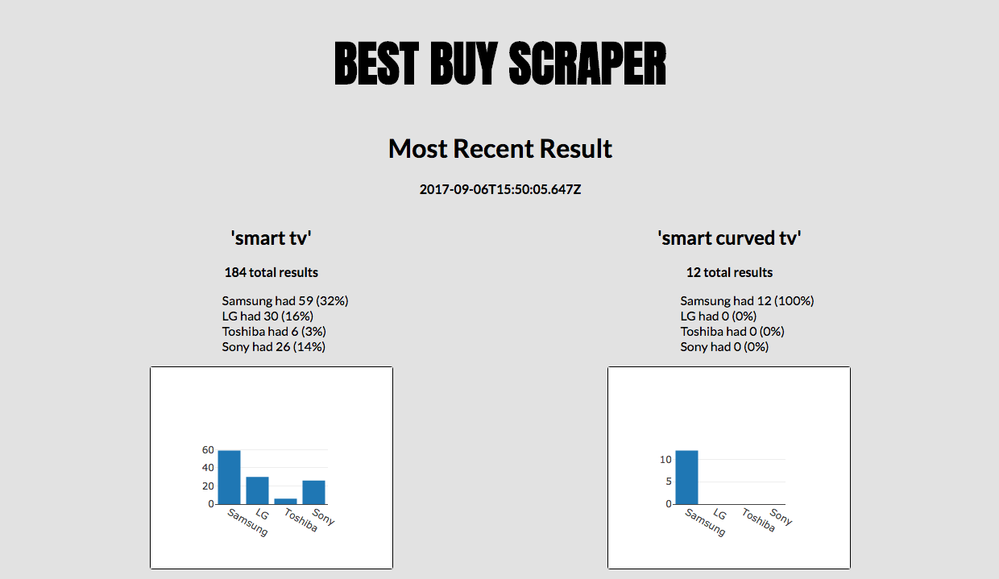
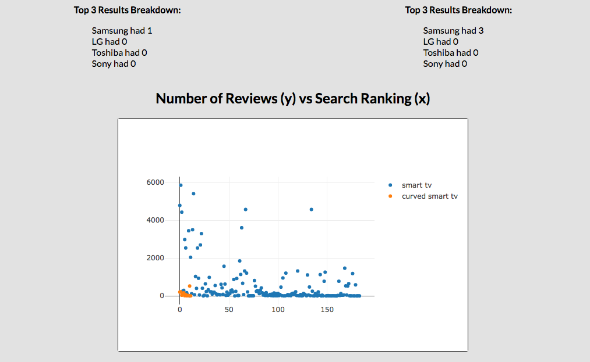
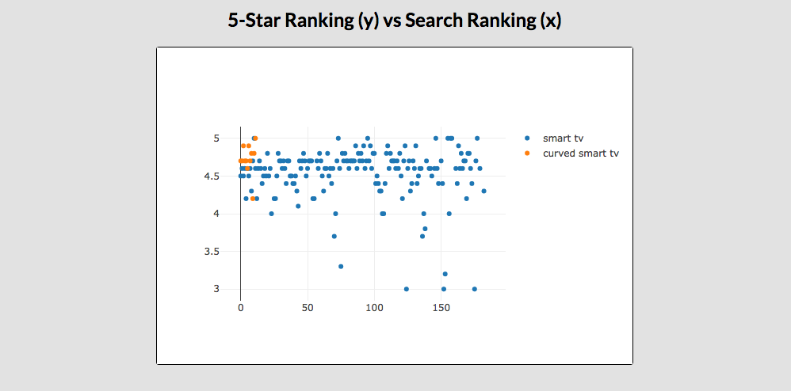
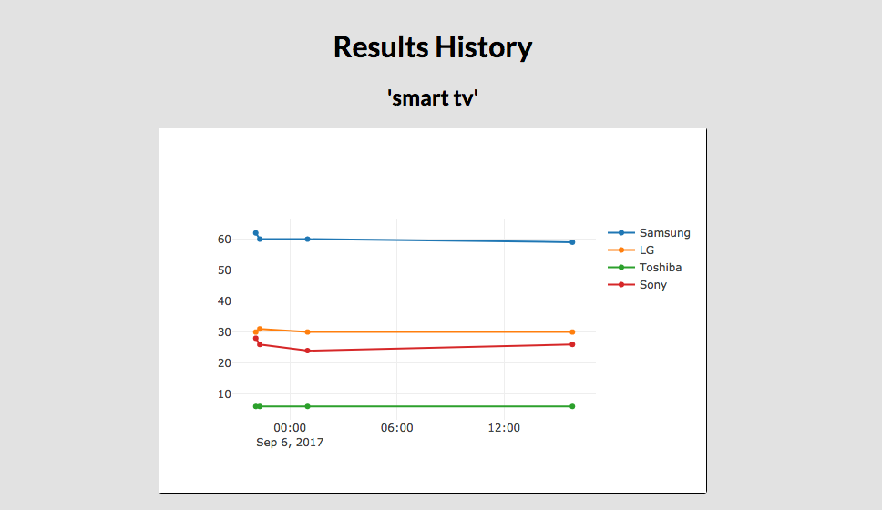
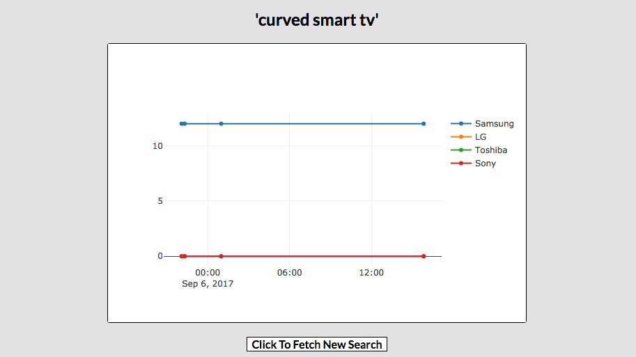

# README

## How it Works

Best Buy Scraper is an app (Ruby on Rails, Postgres, React) I've built to collect the data from search results on Best Buy's website and present it in a readable and interpretable way. The data I'm interested in collecting is the entirety of search results for the terms 'smart tv' and 'curved smart tv' and the number of these results that correspond to particular brands (Samsung, LG, Toshiba, Sony). The majority of the data collection is done here:

```ruby
def create
  @search_result = SearchResult.update
  render :show
end
```
This segment of code is in the SearchResult Rails controller. It looks like a typical create function, but instead of using 'new', I've used 'update'. 'update' is a custom class function for scraping bestbuy.com for search results. 'update' calls a function called 'get_results' with arguments indicating the url of the search we are looking to collect data from. 'get_results' works as follows:

```ruby
def self.get_results(first_half, second_half)
  # Figure out how many results per page, how many pages, and how many total results
  uri = first_half + "1" + second_half
  doc = Nokogiri::HTML(open(uri))
  results_summary = doc.css('div.results-summary')
  words = results_summary[0].text.split
  results_per_page = words[5].to_i - words[3].to_i + 1
  total_results = words[7].to_i
  total_pages = (total_results / results_per_page.to_f).ceil

  #Put all search results in an array
  all_results = []
  (1..total_pages).to_a.each do |page|
    page_uri = first_half + page.to_s + second_half
    page_doc = Nokogiri::HTML(open(page_uri))
    items = page_doc.css('div.list-item')
    all_results += items
  end

  # Seperate into titles, reviews, and ratings
  titles = []
  reviews = []
  ratings = []
  all_results.each do |result|
    title = result.css('div.sku-title h4 a')
    titles << title.text

    num_reviews = result.css('span.number-of-reviews').text
    if num_reviews == ""
      reviews << 0
    else
      reviews << num_reviews.to_i
    end

    rating = result.css('span.star-rating-value').text
    if rating == ""
      ratings << nil
    else
      ratings << rating.to_f
    end
  end


  # Check for frequency of each brand
  brands = {samsung: [], lg: [], toshiba: [], sony: []}
  titles.each_with_index do |result, idx|
    words = result.split
    brands[:samsung] << idx if words.include?("Samsung")
    brands[:lg] << idx if words.include?("LG")
    brands[:toshiba] << idx if words.include?("Toshiba")
    brands[:sony] << idx if words.include?("Sony")
  end
  brands_top3 = {samsung: [], lg: [], toshiba: [], sony: []}
  titles[0..2].each_with_index do |result, idx|
    words = result.split
    brands_top3[:samsung] << idx if words.include?("Samsung")
    brands_top3[:lg] << idx if words.include?("LG")
    brands_top3[:toshiba] << idx if words.include?("Toshiba")
    brands_top3[:sony] << idx if words.include?("Sony")
  end


  return {all_results: all_results, brands: brands, brands_top3: brands_top3, reviews: reviews, ratings: ratings}
end
```

As indicated by the comments, this method works by using Nokogiri CSS indicators to calculate how many results and how many pages of results. We then iterate through all the pages collecting the title, number of reviews, and star rating from each result (also determined through Nokogiri CSS indicators). The title data is parsed to indicate if the result is Samsung, LG, Toshiba, or Sony. All the results are passed back to 'update' where the entire search result data is logged as an entry in the database.

This data is all summoned by the React frontend when an AJAX POST request is made. This happens like so:

## How it Runs

The app is currently being hosted on Heroku. Heroku uses an automatic scheduler to run a rake function (in this case, the 'update' function) every 24 hours. The data collection is a very expensive function that takes a long time and the Heroku scheduler is, unfortunately, not exactly regular. As such, the data collection is not as exactly accurate as I'd like. However, it's certainly regular enough for data analysis on search results.


I've also included a button at the bottom of the page of the offline (non-Heroku) version for deliberate data collection. The offline version is not scheduled for every 24 hours.

## Sample Data
SearchResult is the collection of all data regarding total results, total results by brand, etc for any given data collection.

id, total_smart_tv, samsung_smart_tv, lg_smart_tv, toshiba_smart_tv, sony_smart_tv, samsung_smart_tv_top3, lg_smart_tv_top3, toshiba_smart_tv_top3, sony_smart_tv_top3...
4, 184, 59, 30, 6, 26, 1, 0, 0, 0...
total_curved_tv, samsung_curved_tv, lg_curved_tv, toshiba_curved_tv, sony_curved_tv, samsung_curved_tv_top3, lg_curved_tv_top3, toshiba_curved_tv_top3, sony_curved_tv_top3
12, 12, 0, 0, 0, 3, 0, 0, 0

SearchResultItem is a more specific breakdown of the search result item itself, including reviews, ratings, etc.

id, search_result_id, search_term, reviews, rating
784, 4, 'curved_tv', 1, 5.0

## Screenshots







Thank you for your time! Please let me know if you have any questions at will.p.johnson@gmail.com
